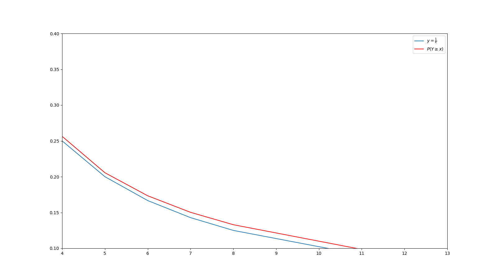

$x \geq 1$  hedef değer olmak üzere $Y$ ise  rasgele sürekli olasılık değişkeni olsun. Yüzde olarak \
$kâr = x-1$ olacaktır.\
(hedef 1.75 ise kâr %75 olur)

$$P(Y \geq x)$$ 
ise sonucun hedef olan $x$ değerinden büyük veya eşit gelme olasılığı olur.Yani kazanma ihtimali. Dolayısıyla 
$$P(Y < x)$$
ise hedeften düşük gelme olasılığı yani oyunu kaybetme ihtimali olur.\

O halde beklenen değer \
**Kâr_ihtimali * kâr - Zarar ihtimali * zarar**\
olacaktır. 
**$$ E(Y) = P(Y \geq x) (x-1) - P(Y<x) $$**

biliyoruzki $P(Y<x) + P(Y \geq x) = 1$ dolayısıyla $P(Y<x) = 1-P(Y \geq x)$
O halde yeni beklenen değer
$$
\begin{align}
E(Y) &= P(Y \geq x) (x-1) - P(Y<x) \\
     &= P(Y \geq x) (x-1) - (1-P(Y \geq x)) \\
     &= P(Y \geq x) (x-1) -1 + P(Y \geq x) \\
     &= P(Y \geq x)((x-1)+1) -1 \\
     &= P(Y \geq x)x -1
\end{align}
$$

Değerinin (beklenen değerin) 0'dan büyük olmasını istiyoruz.
$$
\begin{align}
E(Y) &= P(Y \geq x)((x-1)+1) -1 >0 \\
&=> P(Y\geq x)(x-1+1)>1 \\
&=> P(Y \geq x)x > 1\\
&=> P(Y\geq x) > \frac{1}{x}
\end{align}
$$

Yani beklenen değerin ($E(Y)$'nin) $0$'dan büyük olması için $P(Y\geq x) > \frac{1}{x}$ olmalıdır.

**$$E(Y)>0 <=> P(Y\geq x) > \frac{1}{x}$$**

***Yani aslında hedefim olan $x$ değerinin veya üstünün gelme olasılığı $\frac{1}{x}$ 'ten büyük ise kârlı olur(Beklenen değer 0'dan büyük olur)***

## $P(Y\geq x)$ Değerinin Hesaplanması

$P(Y=x)$ değeri oyunun tam $x$ değerinde bitme olasılığıdır. Benzer şekilde $P(Y<x)$ ise oyunun
hedef $x$ değerine ulaşmadan bitme yani kaybetme olasılığıdır. $P(Y>x)$ ise oyunun hedef $x$ değerini aşma olasılığıdır.(Kazanç)\
Dolayısıyla $$P(Y<x) + P(Y = x) + P(Y>x) = 1 $$
olur. $P(Y = x) + P(Y>x) = P(Y \geq x)$ olduğundan \
$P(Y<x) + P(Y \geq x) = 1$ olur. 
## Amaç $P(Y \geq x)> \frac{1}{x}$ eşitsizşiğini sağlayan $x$ değerini bulmak
Oyun rastgele değerlerde bittiği için bu değeri hesaplamanın tam bir yolu yok. Ancak eldeki 66bin oyun kullanılarak genel sonuçlara bakılabilir.İşte bazı x değerleri için hesaplar ve sonuçlar.

Öncelikle **$x=2$** olsun. **$P(Y=x) = P(Y=2)$** olur. Yani oyunun tam 2 noktasında bitme olasılığıdır. Elimizdeki veride **66825** tane oyun var ve bunların sadece **253** tanesi tam $2$'de bitmiş.
Yani oyunun $2$'de bitme olasılığı \
$P(Y=2) = \frac{253}{66825} = \%0.379$ \
Benzer şekilde $ P(Y<2) ve P(Y>2)$ de hesaplanabilir.
$ P(Y<2) $ oyunun 2'den önce bitme olasılığıdır.
**66825** oyundan **33229** tanesi 2'den önce bitmiştir dolayısıyla\
$P(Y<2) = \frac{33229}{66825} = \%49.726$ \
ve benzer şekilde $P(Y>2)$ de hesaplanabilir.
$ P(Y>2) $ oyunun 2'den sonra bitme olasılığıdır.
**66825** oyundan **33343** tanesi 2'den sonra bitmiştir dolayısıyla\
$P(>2) = \frac{33343}{66825} = \%49.895$  olur.\
Başka $x$ değerleri içinde hesaplanıp tablo yapılırsa (*yaklaşık değerlere yuvarlayarak*)

| x değeri  | $P(Y<x)$  | $P(Y=x)$  | $P(Y>x)$  |
|-----------|-----------|-----------|-----------|
| ***x=1.2*** | %18.46  | %0.5      | %80       |
| ***x=1.5*** | %33.95  | %0.4      | %65.63    |
| ***x=2***   | %49.72  | %0.37     | %49.89    |
| ***x=5***   | %79.44  | %0.03     | %20.51    |
| ***x=11***  | %90.15  | %0.00002  | %9.84     |
| ***x=15***  | %92.93  | %0.00001  | %7.06     |

$P(Y = x) + P(Y>x) = P(Y \geq x)$ olduğu için tabloyu düzenler isek
| x değeri  | $P(Y<x)$  | $P(Y\geq x)$ | 
|-----------|-----------|--------------|
| ***x=1.2*** | %18.46  | %81.54       |
| ***x=1.5*** | %33.95  | %66.05       |
| ***x=2***   | %49.72  | %50.28       |
| ***x=5***   | %79.44  | %20.56       | 
| ***x=11***  | %90.15  | %9.85        | 
| ***x=15***  | %92.93  | %7.07        | 

**Bu tabloda bazı $x$ değerleri için $P(Y \geq x)$ olasılığının sonuçları gösterildi.Bu sonuçlar geçmiş 66825 oyunun verisi göz önüne alınarak oluşturuldu.**
$P(Y \geq x) > \frac{1}{x}$ yani $E(Y)>0$ değerini sağlayan $x$ değer(ler)ini bulmaya çalışıyorum.

|   x değeri |   $P(Y\geq x)$ |   $1/x$ | olasılık 1/x'ten büyükmü?   |
|-----------:|---------------:|-------------:|:----------------------------|
|        1.1 |      0.886525  |    0.909091  | False                       |
|        1.3 |      0.757621  |    0.769231  | False                       |
|        1.5 |      0.660486  |    0.666667  | False                       |
|        1.7 |      0.585993  |    0.588235  | False                       |
|        1.9 |      0.52844   |    0.526316  | True                        |
|        2   |      0.502746  |    0.5       | True                        |
|        3   |      0.340097  |    0.333333  | True                        |
|        4   |      0.256341  |    0.25      | True                        |
|        5   |      0.205507  |    0.2       | True                        |
|        6   |      0.173348  |    0.166667  | True                        |
|        7   |      0.150258  |    0.142857  | True                        |
|        8   |      0.132959  |    0.125     | True                        |
|       11   |      0.0984661 |    0.0909091 | True                        |
|       14   |      0.0771867 |    0.0714286 | True                        |
|       17   |      0.0618631 |    0.0588235 | True                        |
|       20   |      0.0533483 |    0.05      | True                        |
|       23   |      0.0466442 |    0.0434783 | True                        |
|       26   |      0.0416611 |    0.0384615 | True                        |

Tablodada görüldüğü gibi bazı x değerleri için istediğim bu özellik sağlamış. Bu şu demek \
### *Bu oyunun oynandığı 66825 oyun boyunca bu x değerlerinde otomatik çıkış yapan birisi kârda olacaktı(İstisnasız her oyuna katılmalı ve her oyunda aynı sayıda çıkmalı)*
True değerleri olasılığın 1/x değerinden büyük eşit olduğu durumlarda var. Yani True olan x değerleri **kârlı**.\
Tabloda göründüğü gibi hedef değer büyüdükçe **kazanan hedef oluyor.**

## Sonuçların görselleştirilmesi

Kırmızı çizgi $P(Y \geq x)$ olasılığını gösterirken mavi çizgi ise $1/x$ değerini gösteriyor. Resimde bazı noktalarda aradaki fark yüksek iken bazı noktalarda pek değil.
Aradaki fark ne kadar yüksek ise alınacak kâr okadar büyük olur. Bir hesaplama ile aradaki farkın (oransal olarak) en yüksek olduğu x değerini buldum.(1.01 ile 50 arasındaki tüm sayıları tek tek denedim).  \
Olabilecek en uygun x değeri ***$x=12.38$*** oldu. Yani maximum kâra $x=12.38$ değerinde ulaşıyoruz.

# $x = 12.38$ Değerinin Test Edilmesi
$P(Y \geq x) = 0.089458$ ve $\frac{1}{x} = 0.080775$ \
Dolayısıyla $P(Y \geq x) > \frac{1}{x}$ ki zaten böyle bir değer arıyorduk. \
\
***Peki bu 66825 oyunun hepsini oynayıp her seferinde tam olarak 12.38 değerinde çıkmaya çalışsaydık sonuç ne olurdu?*** \
Bunu test etmek kolay. Başlangıç parası 3000₺ olsun. Ve her bir oyun için istisnasız 30₺ kullanılıyor olsun.Tabikide eğer 12.38 veya üssü görülürse kazanç aksi taktirde zarar olacak.(66825 oyun içinde bu kural geçerli)
kazanç olması durumunda $30₺*(12.38-1)=341.40₺$ kâr olacak ve zarar durumunda ise $-30₺$ zarar olacak (her oyun için 30₺ kullanıyorum)

### ilk 10 oyunun sonucu böyle olurdu
| Tarih                      | site/firma | sonuç | Kârlı mı? | kazanç | son_para |
|----------------------------|------------|-------|-----------|--------|----------|
| 2024-01-16 04:33:28.099053 | ODIBETS    | 1.12  | False     | -30    | 2970     |
| 2024-01-16 04:33:28.099098 | ODIBETS    | 1.53  | False     | -30    | 2940     |
| 2024-01-16 04:33:28.099115 | ODIBETS    | 2.24  | False     | -30    | 2910     |
| 2024-01-16 04:33:28.099132 | ODIBETS    | 4.63  | False     | -30    | 2880     |
| 2024-01-16 04:33:28.099148 | ODIBETS    | 1.01  | False     | -30    | 2850     |
| 2024-01-16 04:33:28.099164 | ODIBETS    | 1.09  | False     | -30    | 2820     |
| 2024-01-16 04:33:28.099179 | ODIBETS    | 223.72| True      | 341.4  | 3161.4   |
| 2024-01-16 04:33:28.099195 | ODIBETS    | 3.31  | False     | -30    | 3131.4   |
| 2024-01-16 04:33:28.099211 | ODIBETS    | 1.25  | False     | -30    | 3101.4   |
| 2024-01-16 04:33:28.099228 | ODIBETS    | 1.23  | False     | -30    | 3071.4   |

### sonraki 10 oyun ise böyle
| Tarih                       | site/firma | sonuç  | Kârlı mı? | kazanç | son_para |
|-----------------------------|------------|-------:|-----------|-------:|---------:|
| 2024-01-16 04:33:28.099245+00 | ODIBETS   | 14.52  | True      | 341.4  | 3412.8   |
| 2024-01-16 04:33:28.099261+00 | ODIBETS   | 1.01   | False     | -30    | 3382.8   |
| 2024-01-16 04:33:28.099278+00 | ODIBETS   | 1.27   | False     | -30    | 3352.8   |
| 2024-01-16 04:33:28.099293+00 | ODIBETS   | 9.07   | False     | -30    | 3322.8   |
| 2024-01-16 04:33:28.099310+00 | ODIBETS   | 1.45   | False     | -30    | 3292.8   |
| 2024-01-16 04:33:28.099325+00 | ODIBETS   | 5.44   | False     | -30    | 3262.8   |
| 2024-01-16 04:33:28.099341+00 | ODIBETS   | 1.61   | False     | -30    | 3232.8   |
| 2024-01-16 04:33:28.099357+00 | ODIBETS   | 1.55   | False     | -30    | 3202.8   |
| 2024-01-16 04:33:28.099372+00 | ODIBETS   | 1.18   | False     | -30    | 3172.8   |
| 2024-01-16 04:33:28.099388+00 | ODIBETS   | 116.71 | True      | 341.4  | 3514.2   |

### rasgele 5184 ve 5197 arası böyle
| Tarih                       | site/firma | sonuç  | Kârlı mı? | kazanç | son_para |
|-----------------------------|------------|-------:|-----------|-------:|---------:|
| 2024-01-16 09:43:44.312908+00 | ODIBETS   | 2.87   | False     | -30    | 61005    |
| 2024-01-16 09:43:44.312924+00 | ODIBETS   | 1.23   | False     | -30    | 60975    |
| 2024-01-16 09:43:44.312939+00 | ODIBETS   | 2.26   | False     | -30    | 60945    |
| 2024-01-16 09:43:44.312954+00 | ODIBETS   | 2.97   | False     | -30    | 60915    |
| 2024-01-16 09:43:44.312970+00 | ODIBETS   | 2.81   | False     | -30    | 60885    |
| 2024-01-16 09:43:44.312985+00 | ODIBETS   | 2.87   | False     | -30    | 60855    |
| 2024-01-16 09:43:44.313000+00 | ODIBETS   | 12.49  | True      | 341.4  | 61196.4  |
| 2024-01-16 09:43:44.313015+00 | ODIBETS   | 1.03   | False     | -30    | 61166.4  |
| 2024-01-16 09:43:44.313030+00 | ODIBETS   | 1.66   | False     | -30    | 61136.4  |
| 2024-01-16 09:43:44.313047+00 | ODIBETS   | 4.25   | False     | -30    | 61106.4  |
| 2024-01-16 09:43:44.313065+00 | ODIBETS   | 38.65  | True      | 341.4  | 61447.8  |
| 2024-01-16 09:43:44.313080+00 | ODIBETS   | 3.58   | False     | -30    | 61417.8  |
| 2024-01-16 09:43:44.313095+00 | ODIBETS   | 1.07   | False     | -30    | 61387.8  |

### 40bin ile 40010 numaralı oyunlar ise böyle

| Tarih                       | site/firma | sonuç  | Kârlı mı? | kazanç | son_para |
|-----------------------------|------------|-------:|-----------|-------:|---------:|
| 2024-01-25 03:10:27.967541+00 | ODIBETS   | 3.75   | False     | -30    | 237317   |
| 2024-01-25 03:11:11.801836+00 | ODIBETS   | 14.26  | True      | 341.4  | 237658   |
| 2024-01-25 03:11:58.369632+00 | ODIBETS   | 1.44   | False     | -30    | 237628   |
| 2024-01-25 03:11:58.369670+00 | ODIBETS   | 1.44   | False     | -30    | 237598   |
| 2024-01-25 03:12:29.173550+00 | ODIBETS   | 8.1    | False     | -30    | 237568   |
| 2024-01-25 03:13:13.610922+00 | ODIBETS   | 5.31   | False     | -30    | 237538   |
| 2024-01-25 03:13:43.081503+00 | ODIBETS   | 3.91   | False     | -30    | 237508   |
| 2024-01-25 03:14:10.247240+00 | ODIBETS   | 3.43   | False     | -30    | 237478   |
| 2024-01-25 03:14:41.124261+00 | ODIBETS   | 11.52  | False     | -30    | 237448   |
| 2024-01-25 03:15:11.310035+00 | ODIBETS   | 4.46   | False     | -30    | 237418   |

## Genel olarak özetlersek

oyunların $\%9.83$'ünü kazanıyor ama alırken kaybettiğinin 11.38 kat fazlasını aldığı için kârda oluyor. \
3000 tl ile başlayıp her oyun 30 tllik oynadıktan sonra 66815 oyun sonra (yaklaşık 16 gün boyunca her oyuna katıldı) 3000tl 219964 tl'ye çıkıyor. **istatistikler zaten resimde var.** \
12.38 değeri olabilecek en iyi değerdi ama diğer yüksek değerlerdee iyi sonuçlar veriyor.
işte bazı x değerlerinin sonuçları.
| x değeri | Kârlı oyun sayısı | Zararlı oyun sayısı | Art arda gelen maksimum kârlı oyun sayısı | Art arda gelen maksimum zararlı oyun sayısı | Paranın en düşük değeri | Paranın en yüksek değeri | Paranın en son değeri |
|----------|-------------------|---------------------|-------------------------------------------|---------------------------------------------|-------------------------|--------------------------|-----------------------|
| 1.1      | 59242             | 7583                | 79                                       | 4                                           | -46773                  | 3012                     | -46764                |
| 1.3      | 50628             | 16197               | 32                                       | 8                                           | -27342                  | 18006                    | -27258                |
| 1.5      | 44137             | 22688               | 19                                       | 9                                           | -15840                  | 30345                    | -15585                |
| 1.7      | 39159             | 27666               | 16                                       | 12                                          | -5052                   | 38541                    | -4641                 |
| 1.9      | 35313             | 31512               | 13                                       | 14                                          | 726                     | 53913                    | 11091                 |
| 2.0      | 33596             | 33229               | 12                                       | 14                                          | 330                     | 55680                    | 14010                 |
| 3.0      | 22727             | 44098               | 9                                        | 24                                          | 2760                    | 85710                    | 43680                 |
| 4.0      | 17130             | 49695               | 7                                        | 38                                          | 2850                    | 90720                    | 53850                 |
| 5.0      | 13733             | 53092               | 7                                        | 47                                          | 2820                    | 95970                    | 58200                 |
| 6.0      | 11584             | 55241               | 6                                        | 72                                          | 2820                    | 117900                   | 83370                 |
| 7.0      | 10041             | 56784               | 5                                        | 72                                          | 2820                    | 133920                   | 106860                |
| 8.0      | 8885              | 57940               | 4                                        | 72                                          | 2820                    | 145350                   | 130650                |
| 11.0     | 6580              | 60245               | 4                                        | 82                                          | 2820                    | 189120                   | 169650                |
| 14.0     | 5158              | 61667               | 4                                        | 117                                         | 2820                    | 183870                   | 164610                |
| 17.0     | 4134              | 62691               | 4                                        | 131                                         | 2820                    | 127590                   | 106590                |
| 20.0     | 3565              | 63260               | 3                                        | 208                                         | 1980                    | 161190                   | 137250                |
| 23.0     | 3117              | 63708               | 3                                        | 259                                         | -8820                   | 189540                   | 148980                |
| 26.0     | 2784              | 64041               | 3                                        | 259                                         | -7560                   | 215490                   | 169770                |

